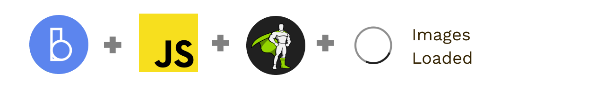

# Barba.js with GreenSock and Images Loaded



Simple JavaScript page transitions using [Barba.js](https://barba.js.org/) and [GreenSock](https://greensock.com/?ref=7856eb) with [Images Loaded](https://imagesloaded.desandro.com/).

## Build

The webpack build and compilation is based on [barba-starter-template by Samuel Berisha.](https://github.com/mrsamse/barba-starter-template)

## Usage

Installation:

```
git clone https://github.com/Ihatetomatoes/barbajs-demos.git
cd barbajs-gsap-imagesLoaded
npm install
```

Watch for changes in your style & code files:

```
npm run dev
```

Create a production ready build:

```
npm run build
```