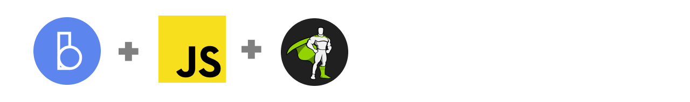

# Barba.js with GreenSock



JavaScript page transitions using [Barba.js](https://barba.js.org/) and [GreenSock](https://greensock.com/?ref=7856eb).

## Build

The webpack build and compilation is based on [barba-starter-template by Samuel Berisha.](https://github.com/mrsamse/barba-starter-template), simplified and cleaned up by [Xavier Foucrier](https://github.com/xavierfoucrier).

## Usage

Installation:

```
git clone https://github.com/Ihatetomatoes/barbajs-demos.git
cd barbajs-gsap-transition
npm install
```

Run a local web server and watch for changes in your style & code files:

```
npm run dev
```

Create a production ready build:

```
npm run build
```
